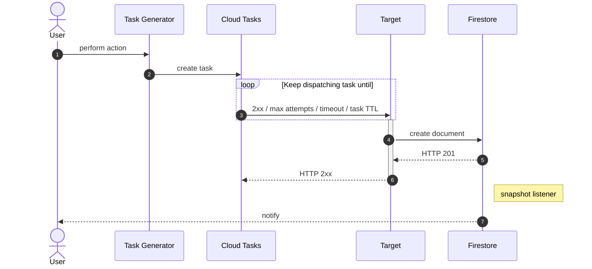

# A more advanced example

```mermaid {theme: 'default', scale: 0.7}
sequenceDiagram
    autonumber
    actor U as User
    participant TG as Task Generator
    participant CT as Cloud Tasks
    participant Target
    participant DB as Firestore
    U->>TG: perform action
    TG->>CT: create task
    loop Keep dispatching task until
        CT->>Target: 2xx / max attempts / timeout / task TTL
    end
    activate Target
    Target->>DB: create document
    DB-->>Target: HTTP 201
    Target-->>CT: HTTP 2xx
    deactivate Target
    Note right of DB: snapshot listener
    DB-->>U: notify
```

<!--
Consider making a ZenUML diagram
https://mermaid.js.org/syntax/zenuml.html
-->
