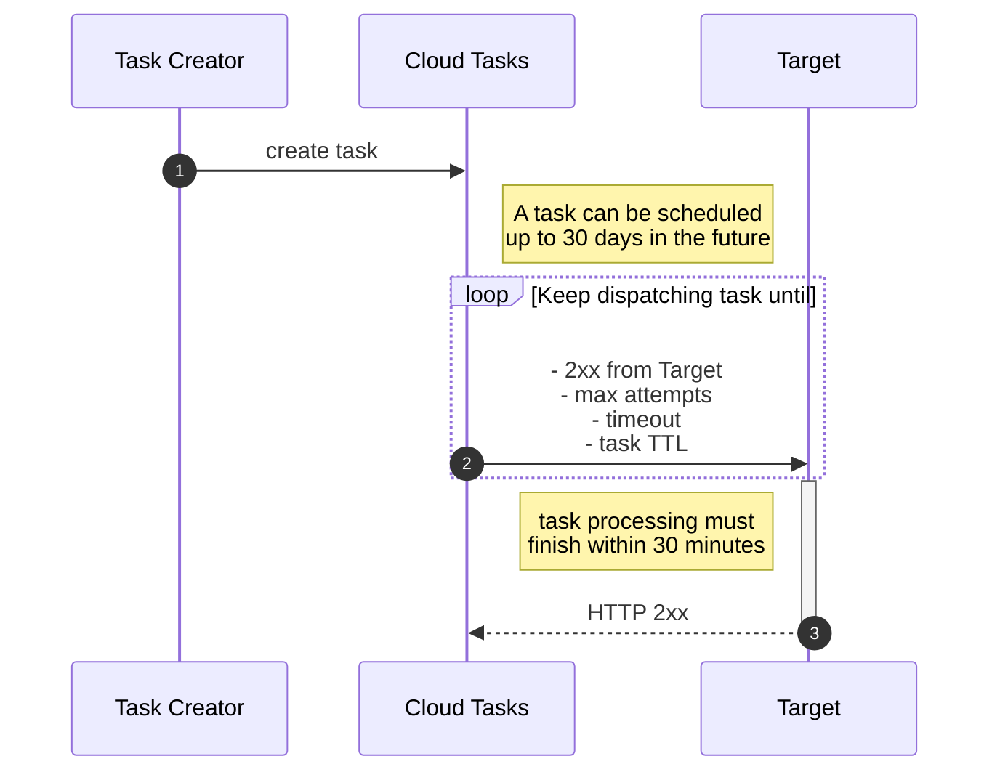

# A basic example

<!--
Timeouts: for all HTTP Target task handlers the default timeout is 10 minutes, with a maximum of 30 minutes.
https://cloud.google.com/tasks/docs/creating-http-target-tasks

https://stackoverflow.com/questions/58530361/how-increase-maximum-schedule-time-in-gcloud-tasks-api

https://cloud.google.com/tasks/docs/reference/rpc/google.cloud.tasks.v2#google.cloud.tasks.v2.Task.FIELDS.google.protobuf.Timestamp.google.cloud.tasks.v2.Task.schedule_time
-->