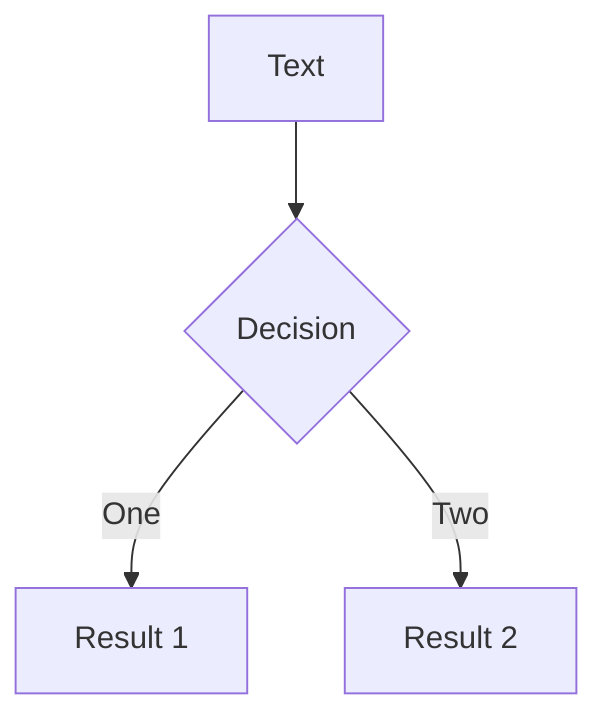
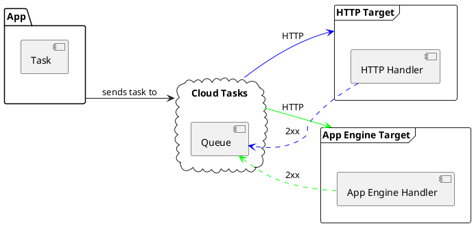
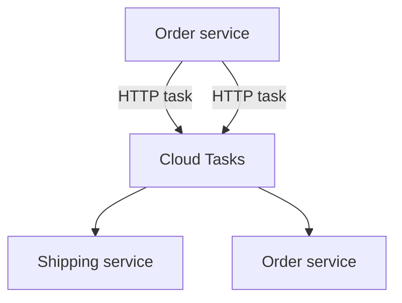

# Diagrams

You can create diagrams / graphs from textual descriptions, directly in your Markdown.

[Learn More](https://sli.dev/guide/syntax.html#diagrams)

<!--
https://mermaid.js.org/config/theming.html

https://mermaid.js.org/syntax/flowchart.html

https://plantuml.com/
https://plantuml.com/component-diagram
-->
