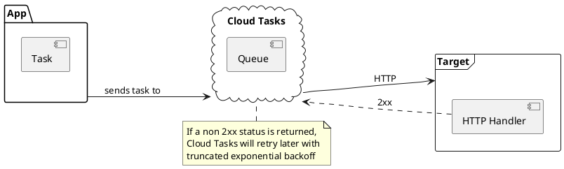

# What is Cloud Tasks?

<Transform scale="0.85">

GCP's **fully managed** service to manage queues of **background tasks**.

Background task implies that the user or requester **does not wait** for the task to finish.

<!--  -->

Use cases:

- Delegating potentially slow operations to a dedicated service
- Preserving requests in the context of a service outage
- Managing third-party API call rates (i.e. avoid HTTP 429 Too Many Requests) and handling retries
- Smoothing traffic spikes out by removing non-user-facing tasks from the main user flow

</Transform>

<!--
Alternatives:

- BullMQ
- pg-boss
- Celery

https://www.draconianoverlord.com/2014/01/27/using-your-database-as-a-queue.html/
https://codeopinion.com/using-your-database-as-a-queue/
https://github.com/litements/litequeue

Example: send an email with sendgrid
https://cloud.google.com/tasks/docs/samples/cloud-tasks-fun
https://cloud.google.com/tasks/docs/tutorial-gcf

Example: avoid HTTP 429 Too Many Requests
https://cloud.google.com/workflows/docs/tutorials/buffer-workflows-executions

Dispatch flow control

(truncated) exponential backoff is a strategy we can use to schedule retries.
https://en.wikipedia.org/wiki/Exponential_backoff#Truncated_exponential_backoff

quotas and limits
https://cloud.google.com/tasks/docs/quotas

https://cloud.google.com/tasks/pricing

Cloud Tasks runs in the App Engine internal infrastructure

PULL queus are just for backwards compatibility with the App Engine Task Queue SDK.
https://cloud.google.com/tasks/docs/reference/rest/v2beta3/projects.locations.queues.tasks#pullmessage
-->
